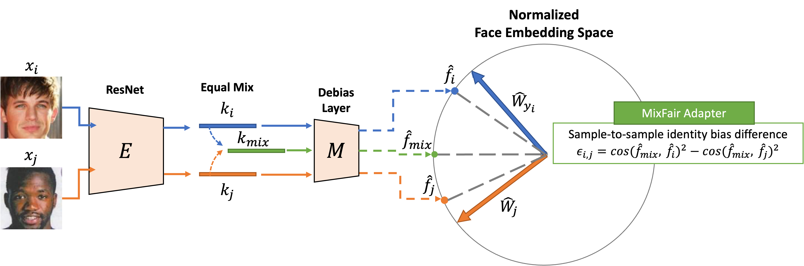

<p align='center'>

</p>

# MixFairFace
The official implementation of our AAAI-23 paper "MixFairFace: Towards Ultimate Fairness via MixFair Adapter in Face Recognition" The final supplementary materials will be released soon!

### [[Paper](https://arxiv.org/abs/2211.15181)]

Our implementation is based on [Pytorch Lightning](https://www.pytorchlightning.ai/). The following features are included:
1. Multiple GPUs Training (DDP)
2. Multiple Nodes Training (DDP)
3. Support [Tensorboard](https://www.tensorflow.org/tensorboard) for logging.


## Dependency
Install required packages with the following commands.
```bash
conda create -n mff python=3.9
conda activate mff
pip install pip --upgrade
pip install -r requirements.txt
```


## Preparing Train/Val/Val-inst Data
1. Val is for previous evaluation protocol (as used in previous works).
2. Val-inst is for our proposed protocol.

**You will need to prepare two zip files. My implementation will load the entire zip files into the memory and extract the images in dataloader, which will improve training efficiency on cloud services.**

### Training Data
The format of our training zip file is as:
```
TrainingData.zip
|-----data/
|---------/index.txt
|---------/img/
|---------/img/0000000.jpg
|---------/img/0000001.jpg
.
.
.
|---------/img/xxxxxxx.jpg
```
For the format of **index.txt**, each line should be:
```
[A comment text (doesn't matter)][attribute index][label index (the idx of the identity)][Exist or not (you can just give "1" here)].
```
You can take a look at my example [index.txt](https://drive.google.com/file/d/1Pe7IZoyI2ii6xqXxSYiP2CFJKkEkKE9B/view?usp=share_link) for reference.


### Val-inst Data (RFW)
The format of our val-inst zip file is as (on RFW dataset):
```
ValInstData.zip
|-----data/
|---------txts/African/African_people.txt
|---------txts/Asian/Asian_people.txt
|---------txts/Caucasian/Caucasian_people.txt
|---------txts/Indian/Indian_people.txt
|---------data/African/m.0x1lfrd/
|-------------------------------/m.0x1lfrd_0001.jpg
...
|-------------------------------/m.0x1lfrd_xxxx.jpg
|---------data/African/m.0xsk8/
|-----------------------------/m.0xsk8_0001.jpg
...
|-----------------------------/m.0xsk8_xxxx.jpg
...
|---------data/Asian/m.0z08d8y/
|-----------------------------/m.0z08d8y_0001.jpg
...
|-----------------------------/m.0z08d8y_xxxx.jpg
...
```
For **xxxx_people.txt** files, you can just copy them from original [RFW](http://www.whdeng.cn/RFW/index.html) dataset. The id **m.0xsk8_0001** represent the id of each identity in the dataset (provided by RFW).

### Val Data (RFW)
For val data, you can just copy the bin files from original RFW datasets without compressing them into a zip file.
```
RFW_bin/
|------/African_test.bin
|------/Asian_test.bin
|------/Caucasian_test.bin
|------/Indian_test.bin
```
The four bin files are provided by RFW dataset.


## Training and Validation
Please modify the path (The positions of **zip_path** and **dataset_path**) in [config.yaml](./config.yaml). You can use the following command for traing/val.
```bash
python main.py --mode train # For training
python main.py --mode val # For validation (previous evaluation protocol)
python main.py --mode val-inst # For validation (our proposed evaluation protocol)
```
For **val-inst**, it will use about 60 GB memory for calculating the cosine similarity of all pair combination in the dataset.

## To-Do
1. Release the pretrained model of balancedface and globalface.
2. Reduce the memory usage of the proposed protocol.
